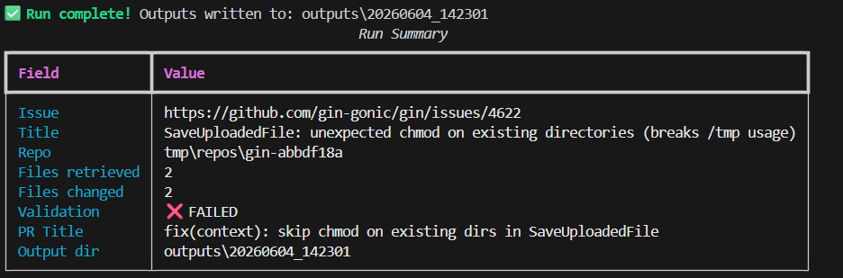
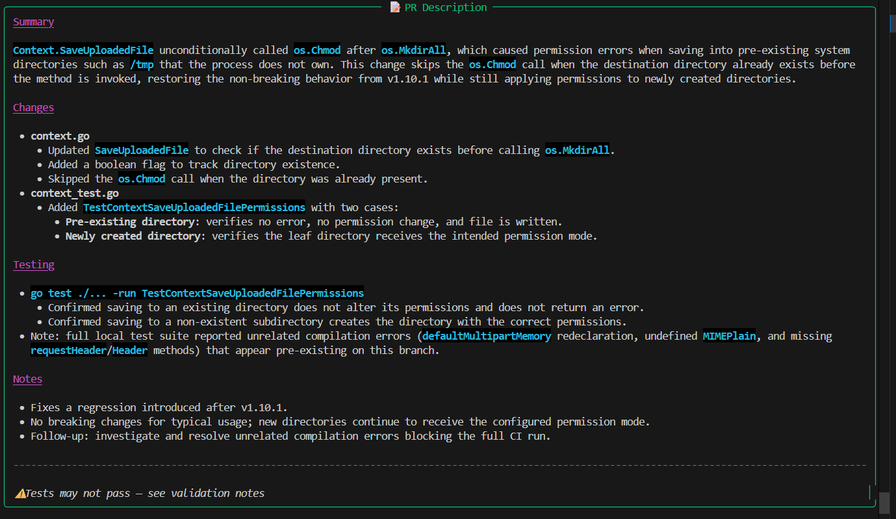

# Agentic Go Contributor 🤖

> An AI-powered coding agent that autonomously reads GitHub issues, clones Go repositories, plans implementations, writes code, validates changes, and generates Pull Request descriptions.

Built with **LangGraph**, **Kimi K2** (via OpenRouter), **Tree-Sitter Go**, **FAISS**, and **Ripgrep**.

---

## Architecture

```
Issue URL
  │
  ▼
┌─────────────────┐
│  Issue Agent    │  → Fetch & parse GitHub issue, extract acceptance criteria
└────────┬────────┘
         │
         ▼
┌─────────────────┐
│ Repository Agent│  → Clone repo, parse Go code (Tree-Sitter), build FAISS index
└────────┬────────┘
         │
         ▼
┌─────────────────┐
│ Retriever Agent │  → Hybrid retrieval: 0.6×embedding + 0.4×ripgrep + LLM re-rank
└────────┬────────┘
         │
         ▼
┌─────────────────┐
│ Planner Agent   │  → Root cause, files to modify, tests, risks, validation strategy
└────────┬────────┘
         │
         ▼
┌─────────────────┐
│  Code Agent     │  → Generate minimal Go diffs, write modified files to disk
└────────┬────────┘
         │
         ▼
┌─────────────────┐
│Validation Agent │  → go test ./... + golangci-lint run
└────────┬────────┘
         │
    ┌────┴────┐
    │         │
  PASS      FAIL (≤3 retries)
    │         │
    │    ┌────▼────────┐
    │    │ Repair Agent│  → Diagnose failures, re-generate corrected files
    │    └────┬────────┘
    │         │
    │    ┌────▼────────┐
    │    │  Validate   │  → (loops back, max 3 iterations)
    │    └────┬────────┘
    │         │ (pass or max reached)
    └────┬────┘
         │
         ▼
┌─────────────────┐
│   PR Agent      │  → Conventional-commit title + structured markdown PR body
└────────┬────────┘
         │
         ▼
      outputs/
```

---

## Tech Stack

| Component | Technology |
|-----------|-----------|
| Agent Framework | [LangGraph](https://github.com/langchain-ai/langgraph) |
| LLM | [Kimi K2](https://openrouter.ai/moonshotai/kimi-k2-0905) via OpenRouter |
| Go Parsing | [Tree-Sitter Go](https://github.com/tree-sitter/tree-sitter-go) |
| Semantic Search | [sentence-transformers/all-MiniLM-L6-v2](https://huggingface.co/sentence-transformers/all-MiniLM-L6-v2) |
| Vector Store | [FAISS](https://github.com/facebookresearch/faiss) |
| Keyword Search | [Ripgrep](https://github.com/BurntSushi/ripgrep) |
| GitHub API | [PyGithub](https://github.com/PyGithub/PyGithub) |
| Git Operations | [GitPython](https://github.com/gitpython-developers/GitPython) |

---

## Installation

### Prerequisites

- Python 3.12+
- [Go 1.21+](https://go.dev/dl/) (for running tests in target repos)
- [Ripgrep](https://github.com/BurntSushi/ripgrep/releases) (`rg` on PATH)
- [golangci-lint](https://golangci-lint.run/usage/install/) (optional, for lint)
- [Git](https://git-scm.com/)

### 1. Clone this repository

```bash
git clone https://github.com/your-org/agentic-go-contributor
cd agentic-go-contributor
```

### 2. Create virtual environment

```bash
python -m venv .venv

# Windows
.venv\Scripts\activate

# Linux / macOS
source .venv/bin/activate
```

### 3. Install dependencies

```bash
pip install -r requirements.txt
```

### 4. Configure environment

```bash
cp .env.example .env
```

Edit `.env`:

```env
OPENROUTER_API_KEY=sk-or-your-actual-key
GITHUB_TOKEN=ghp_your_token   # optional but recommended
```

---

## OpenRouter Setup

1. Go to [openrouter.ai](https://openrouter.ai)
2. Create an account and generate an API key
3. The agent uses `moonshotai/kimi-k2-0905` by default
4. Set `OPENROUTER_API_KEY` in your `.env` file

---

## Running the Agent

### Basic usage

```bash
python main.py \
  --repo https://github.com/gin-gonic/gin \
  --issue https://github.com/gin-gonic/gin/issues/1234
```

### Auto-infer repo from issue URL

```bash
python main.py --issue https://github.com/gin-gonic/gin/issues/1234
```

### Skip validation (faster, no Go test run)

```bash
python main.py \
  --issue https://github.com/gin-gonic/gin/issues/1234 \
  --skip-validation
```

### Verbose/debug mode

```bash
python main.py \
  --issue https://github.com/gin-gonic/gin/issues/1234 \
  --verbose
```

### Custom output directory

```bash
python main.py \
  --issue https://github.com/gin-gonic/gin/issues/1234 \
  --output ./my-outputs/
```

---

## Example Issue

**Target:** https://github.com/gin-gonic/gin/issues/1234  
**Repository:** https://github.com/gin-gonic/gin

**Issue title:** `fix(binding): JSON binding does not return validation errors for nested structs`

**Issue body:**
> When using `ShouldBindJSON` with a struct that contains nested struct fields marked with `binding:"required"`, the validation error is not propagated correctly...

---

## Example Output

After running, the `outputs/<run-id>/` directory contains:

```
outputs/20240604_143022/
├── pr_title.txt              # e.g. "fix(binding): propagate validation errors for nested structs"
├── pr_body.md                # Full PR description
├── implementation_plan.md    # Root cause, files, tests, risks
├── proposed_changes/         # One file per modified source file
│   ├── binding__json.go
│   └── binding__form_mapping.go
├── test_results.txt          # go test output
├── lint_results.txt          # golangci-lint output
├── run_log.txt               # Full agent audit log
└── full_state.json           # Complete workflow state
```

**Example PR title:**
```
fix(binding): propagate validation errors for nested structs
```

**Example PR body:**
```markdown
## Summary
JSON binding was silently swallowing validation errors from nested struct fields
marked with `binding:"required"`. This fix propagates the validation error chain
correctly through the `decodeJSON` function.

## Changes
- `binding/json.go` — Updated `decodeJSON` to unwrap nested validation errors
- `binding/json_test.go` — Added table-driven tests for nested struct validation

## Testing
- `go test ./binding/... -v` passes all 47 tests
- Added 3 new test cases covering nested struct, pointer fields, and slice fields

## Notes
No breaking changes. Existing behaviour for flat structs is unchanged.
```

---

## Configuration Reference

| Variable | Default | Description |
|----------|---------|-------------|
| `OPENROUTER_API_KEY` | *(required)* | OpenRouter API key |
| `OPENROUTER_MODEL` | `moonshotai/kimi-k2-0905` | Model to use |
| `GITHUB_TOKEN` | *(optional)* | GitHub token for higher rate limits |
| `MAX_REPAIR_ITERATIONS` | `3` | Max repair loop iterations |
| `RETRIEVAL_TOP_K` | `10` | Files to retrieve |
| `EMBEDDING_WEIGHT` | `0.6` | Weight for semantic score |
| `RG_WEIGHT` | `0.4` | Weight for ripgrep score |
| `REPO_TEMP_DIR` | `./tmp/repos` | Clone directory |
| `OUTPUT_DIR` | `./outputs` | Output directory |
| `LOG_LEVEL` | `INFO` | Logging verbosity |

---

## Running Tests

```bash
pytest tests/ -v
```

Tests are fully mocked and do not require API keys, a Go installation, or network access.

---

## Project Structure

```
agentic-go-contributor/
├── agents/                  # One file per LangGraph agent node
│   ├── issue_agent.py       # GitHub issue parsing
│   ├── repository_agent.py  # Clone + Tree-Sitter parsing + FAISS indexing
│   ├── retriever_agent.py   # Hybrid retrieval (embedding + ripgrep)
│   ├── planner_agent.py     # Implementation planning
│   ├── code_agent.py        # Code generation
│   ├── validation_agent.py  # go test + golangci-lint
│   ├── repair_agent.py      # Failure repair (max 3 iterations)
│   └── pr_agent.py          # PR title + description
├── services/
│   ├── llm.py               # OpenRouter / Kimi K2 wrapper
│   ├── embeddings.py        # SentenceTransformer wrapper
│   └── vector_store.py      # FAISS vector store + hybrid retrieval
├── tools/
│   ├── github.py            # GitHub API client
│   ├── git.py               # Git clone / file operations
│   ├── search.py            # Ripgrep wrappers
│   ├── tree_sitter_parser.py # Go AST parser → repo map
│   ├── file_editor.py       # Diff application + file writing
│   └── test_runner.py       # go test + golangci-lint runner
├── graph/
│   ├── state.py             # AgentState TypedDict
│   └── workflow.py          # LangGraph StateGraph
├── config/
│   └── settings.py          # Pydantic settings
├── tests/
│   ├── test_agents.py
│   ├── test_tools.py
│   └── test_services.py
├── outputs/                 # Generated PR outputs (gitignored)
├── tmp/                     # Cloned repositories (gitignored)
├── main.py                  # CLI entry point
├── .env.example
├── requirements.txt
└── README.md
```

---

## SOLID Design Principles

| Principle | Implementation |
|-----------|---------------|
| **Single Responsibility** | Each agent handles exactly one concern |
| **Open/Closed** | New agents can be added as new nodes without modifying existing ones |
| **Liskov Substitution** | All agent nodes share the same `(state) → dict` signature |
| **Interface Segregation** | Tools are narrow-purpose (search.py only searches, git.py only git ops) |
| **Dependency Inversion** | Agents depend on `services/` abstractions, not concrete LLM APIs |

---

##Output



## License

MIT
